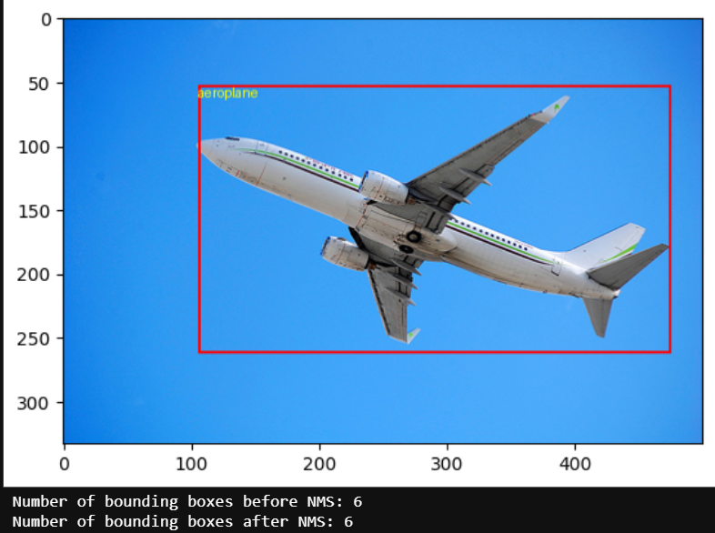
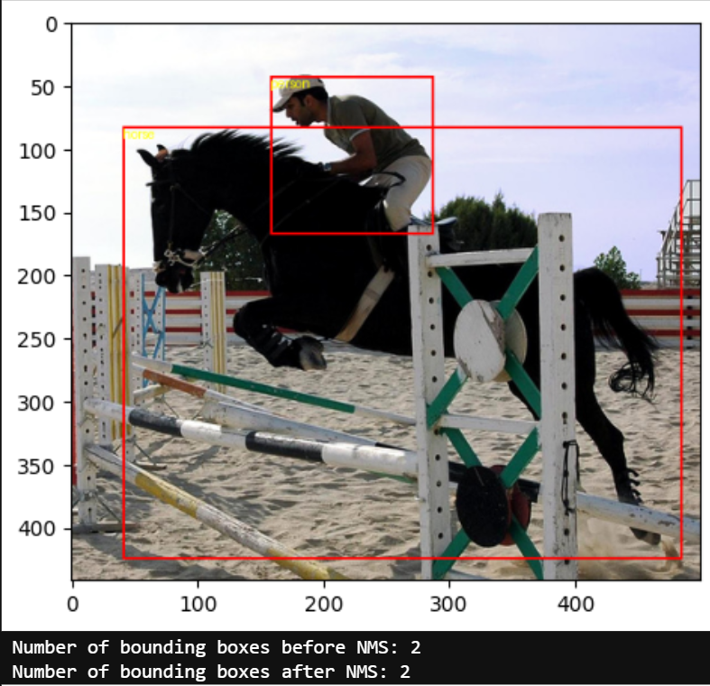
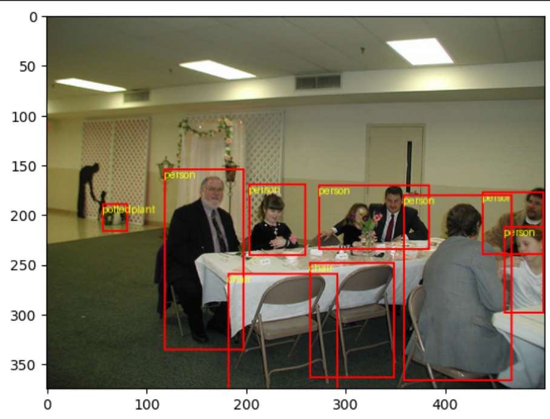
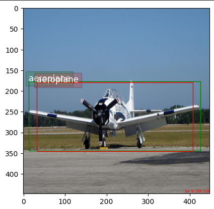

# YOLOv1 (from scratch) – Pascal VOC 2012

This project is a **from-scratch implementation of the YOLOv1 (You Only Look Once)** object detection model using **PyTorch**, evaluated on the **Pascal VOC 2012** dataset.

> 🧪 This repository does **not focus on training**. Instead, it demonstrates **inference on sample images** using a manually implemented YOLOv1 model.

---

## 📘 Highlights

- Implemented entirely from scratch in **PyTorch**.
- Jupyter Notebook interface: easy to follow and experiment.
- Uses a small subset of Pascal VOC 2012 images for demonstration.
- Inference output includes predicted bounding boxes and class labels.
- Includes:
  - Custom data loader for VOC-style annotations
  - YOLOv1 model (Darknet-style backbone + head)
  - Manual IoU and NMS implementations
  - Custom visualization of predicted vs. ground truth boxes
  - Basic mAP calculation for evaluation

---

## 🖼 Sample Outputs

The model performs inference on sample images from the Pascal VOC 2012 dataset. The output includes:

- Bounding boxes with class labels drawn directly on the original images.
- Visualization of both predicted and ground-truth boxes for comparison.
- Evaluation metrics such as IoU and mAP displayed directly in the notebook.

<p align="center">
  
  
  
  
  
  
</p>

---

## 📂 File Structure

- `[colab]_YOLO_V1.ipynb`: Main notebook for running inference and visualization.
- `model.py`: Contains the YOLOv1 architecture.
- `utils.py`: Helper functions (IoU, NMS, plotting).
- `voc_dataset.py`: Loads and parses Pascal VOC-style annotations.
- `evaluate.py`: Contains mAP evaluation code.
- `data/`: Folder containing sample images and labels in Pascal VOC format.

---

## 📎 Requirements

```bash
pip install torch torchvision matplotlib opencv-python
